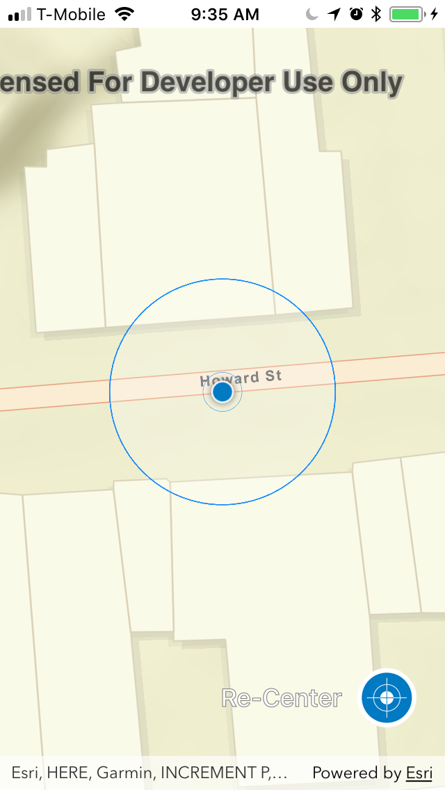
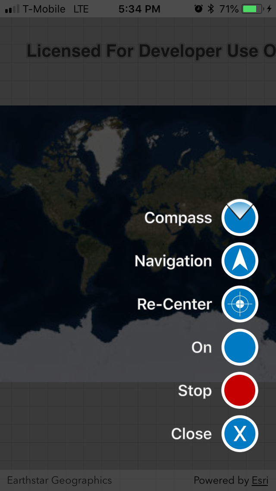

This is an example of Navisens' SDK integration with ArcGIS' SDK.

Then retrieve a Navisens SDK key [here](https://navisens.com/).  
And add it to the `runMotionDna` method in the `MotionDnaController.swift` file.

When you are done with all your key retrievals, run:
```
pod install // Will install latest MotionDna SDK and ArcGIS SDK version 100.3
open arcgis-helloworld.xcworkspace // Will launch xcode
```

After completing these steps you can launch the app and click the menu button to initiate the Navisens tracking
on the ArcGIS canvas.

Have fun!



